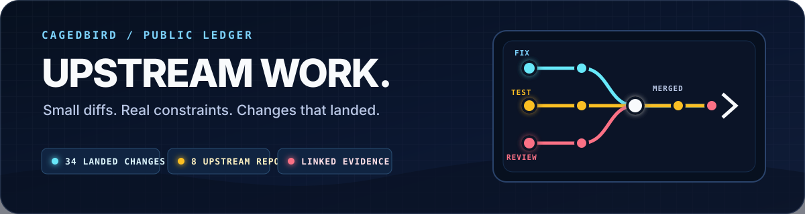

  

  <strong>A curated, evidence-linked record of fixes and features that reached canonical upstream histories.</strong>
   
  Every entry below landed in public upstream. Fork and mirror copies are not counted twice.

  
  
  

## At a glance

- **KDE Connect** — 2 merged first-contribution MRs across desktop and Android.
- **Oh My Pi** — 9 merged PRs across authentication, providers, streams, and CJK context handling.
- **Sub2API** — 14 merged PRs across model routing, admin reliability, templates, and operator guidance.
- **PIPA** — 4 merged PRs fixing profiling initialization, export generation, and onboarding.
- **FreeLLMAPI** — 2 merged PRs for pooled quotas and multi-key load balancing.
- **AnySearch Skill** — 2 merged PRs improving OpenCode installation and routine skill behavior.
- **sing-tun** — 1 canonical upstream commit correcting loopback handling in nftables rules.

## Complete ledger

<strong>KDE Connect</strong> · 2 landed merge requests · desktop and Android

### KDE Connect desktop · [Invent !965](https://invent.kde.org/network/kdeconnect-kde/-/merge_requests/965)

**Problem.** Fire-and-forget payload transfers opened a TCP server in the `1739–1764` range. If the receiver never connected, the port remained occupied until the daemon restarted.

**Change.** Added a bounded connection timeout to `CompositeUploadJob`, closed the server on timeout or cancellation, and added a testing seam plus regression coverage.

**Evidence.** [KDE Invent !965](https://invent.kde.org/network/kdeconnect-kde/-/merge_requests/965) · [GitHub upstream commit `94baac4`](https://github.com/KDE/kdeconnect-kde/commit/94baac4b28589260b2348cbc0980711c83aba9ea) · [KDE Bug 516765](https://bugs.kde.org/show_bug.cgi?id=516765)

### KDE Connect Android · [Invent !650](https://invent.kde.org/network/kdeconnect-android/-/merge_requests/650)

**Problem.** Some Android userspace VPN and tailnet transports deliver inbound peer TCP to the app as a loopback socket, causing KDE Connect to reject the connection before identity and TLS handling.

**Change.** Added loopback to the private-address gate in the maintainer-requested narrow patch.

**Evidence.** [KDE Invent !650](https://invent.kde.org/network/kdeconnect-android/-/merge_requests/650) · [GitHub upstream commit `bfab7c8`](https://github.com/KDE/kdeconnect-android/commit/bfab7c89496055914240b6d8c3541140b853aeeb) · [KDE Bug 520110](https://bugs.kde.org/show_bug.cgi?id=520110)

<strong>Oh My Pi</strong> · 9 merged pull requests

### Authentication and credential lifecycle

- [#4799](https://github.com/can1357/oh-my-pi/pull/4799) — Rotate Codex credentials before provider fallback.
- [#2972](https://github.com/can1357/oh-my-pi/pull/2972) — Persist session-sticky credentials in SQLite across restarts.
- [#2932](https://github.com/can1357/oh-my-pi/pull/2932) — Route the Google OAuth callback through `127.0.0.1` for reliable loopback startup.
- [#2929](https://github.com/can1357/oh-my-pi/pull/2929) — Make legacy API-key cleanup atomic inside the OAuth login transaction.

### Provider and stream reliability

- [#4575](https://github.com/can1357/oh-my-pi/pull/4575) — Classify insufficient-quota gateway errors correctly.
- [#4400](https://github.com/can1357/oh-my-pi/pull/4400) — Honor hidden-summary requests in the Gemini provider.
- [#3191](https://github.com/can1357/oh-my-pi/pull/3191) — Filter thought leakage from Gemini streaming responses.
- [#2860](https://github.com/can1357/oh-my-pi/pull/2860) — Route the Antigravity catalog through the primary daily endpoint.

### Context handling

- [#3053](https://github.com/can1357/oh-my-pi/pull/3053) — Fall back from compact snapshots to text summaries for high CJK/non-ASCII content.

<strong>Sub2API</strong> · 14 merged pull requests

### Model catalogs, routing, and templates

- [#651](https://github.com/Wei-Shaw/sub2api/pull/651) — Add cross-platform mapping warnings and intelligent filtering to the bulk editor.
- [#639](https://github.com/Wei-Shaw/sub2api/pull/639) — Reuse canonical default models in admin connection tests instead of duplicating Gemini lists.
- [#638](https://github.com/Wei-Shaw/sub2api/pull/638) — Refresh the OpenCode template for Claude 4.6 and complete model support.
- [#636](https://github.com/Wei-Shaw/sub2api/pull/636) — Add Gemini 3.1 Pro High/Low support to connection tests.
- [#632](https://github.com/Wei-Shaw/sub2api/pull/632) — Align Gemini `v1beta` templates with the canonical model and mapping order.
- [#631](https://github.com/Wei-Shaw/sub2api/pull/631) — Complete OpenAI and Antigravity model configuration in the OpenCode template.
- [#625](https://github.com/Wei-Shaw/sub2api/pull/625) — Supply the default Gemini 3.1 Pro passthrough mapping.
- [#624](https://github.com/Wei-Shaw/sub2api/pull/624) — Add a Gemini 3.1 Pro passthrough shortcut.
- [#623](https://github.com/Wei-Shaw/sub2api/pull/623) — Complete Antigravity mapping upgrades and shortcut actions.
- [#608](https://github.com/Wei-Shaw/sub2api/pull/608) — Move Antigravity routing from Gemini 3 Pro to Gemini 3.1 Pro.
- [#605](https://github.com/Wei-Shaw/sub2api/pull/605) — Make the Antigravity User-Agent version configurable.

### Reliability and operator guidance

- [#628](https://github.com/Wei-Shaw/sub2api/pull/628) — Document model-mapping loss during cross-platform bulk changes.
- [#622](https://github.com/Wei-Shaw/sub2api/pull/622) — Clear recoverable account errors after a successful usage refresh.
- [#621](https://github.com/Wei-Shaw/sub2api/pull/621) — Fix Gemini authorization URL generation and improve the failure path.

<strong>PIPA</strong> · 4 merged pull requests

- [#58](https://github.com/ZJU-SPAIL/pipa/pull/58) — Rework the quickstart guide around automated setup steps.
- [#57](https://github.com/ZJU-SPAIL/pipa/pull/57) — Fix `pipashu` initialization failures and refactor its parsers.
- [#56](https://github.com/ZJU-SPAIL/pipa/pull/56) — Correct the `dmidecode` path used by the export generator.
- [#55](https://github.com/ZJU-SPAIL/pipa/pull/55) — Fix a silent script-generation crash caused by a missing argument.

<strong>FreeLLMAPI</strong> · 2 merged pull requests

- [#459](https://github.com/tashfeenahmed/freellmapi/pull/459) — Scale monthly fallback budgets by active-key count for pooled multi-account quota.
- [#457](https://github.com/tashfeenahmed/freellmapi/pull/457) — Enable multi-key load balancing for embeddings and media.

<strong>AnySearch Skill</strong> · 2 merged pull requests

- [#6](https://github.com/anysearch-ai/anysearch-skill/pull/6) — Avoid redundant documentation calls during routine skill use.
- [#5](https://github.com/anysearch-ai/anysearch-skill/pull/5) — Fix the OpenCode skill installation path.

<strong>sing-tun</strong> · 1 canonical upstream commit

- [`9504fcd`](https://github.com/SagerNet/sing-tun/commit/9504fcd4557347a29131521ff0bc0be6af97d27a) — Skip the loopback interface when creating nftables unreachable rules.

## Curation rules

- Count only changes that landed in a canonical public upstream repository.
- Link the review record and canonical commit whenever both are available.
- Do not double-count mirrors, downstream forks, or copied commits.
- Prefer problem, change, and evidence over raw activity totals.
- Update manually so editorial judgment stays part of the record.

  Last reviewed 2026-07-17 · <a href="https://github.com/cagedbird043">Back to the profile</a>

